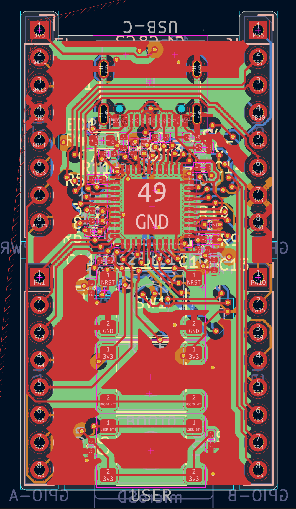
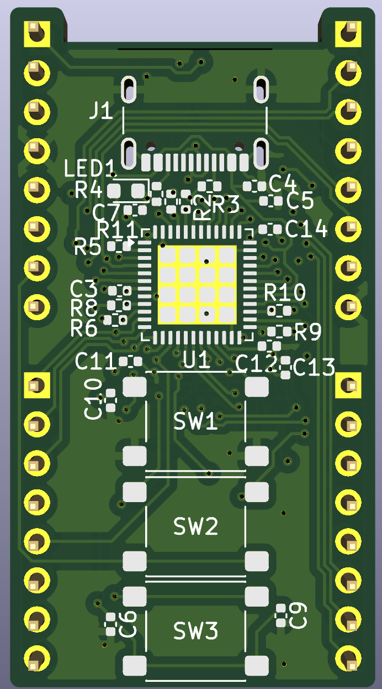

# Devboard

A small STM32 devboard for deving

## details
- Compatible with a breadboard
- USB-C programming port
- SD card holder
- 32 pins total, of which 16 are digital, 6 are analog, 8 are misc/power
- STM32 MCU
- 4 layer board
- 24x44mm board size
- 2 side component assembly

## images
The board in PCB editor: 
The board in 3d viewer: 

## goal
- Purpose: a functional and useful devboard
- MCU: STM32 (MCU_ST_STM32F4:STM32F411CEUx)
- Features: USB-C + UART, SD card, expanded GPIO
- Size: as small as possible

## status

project finished!!
Once I get funding, I will order 10 assembled PCBs from PCBway.

## repo structure
- `devboard.kicad_pro` / `.kicad_sch` / `.kicad_pcb`: KiCad project (root)
- `journal.md`: devlog journals
- `README.md`: this file
- `production`: production files, like gerbers, bom, cpl

Designed by EVV
Made for Hack Club Half Life
9/16/26