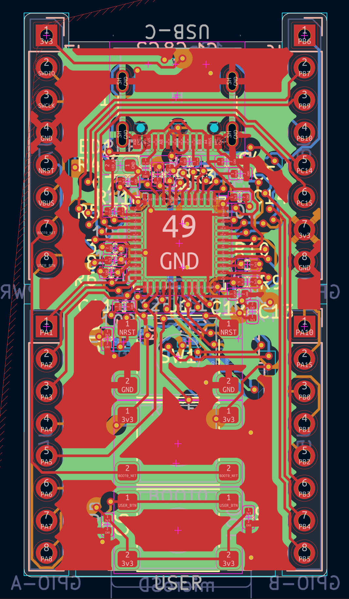
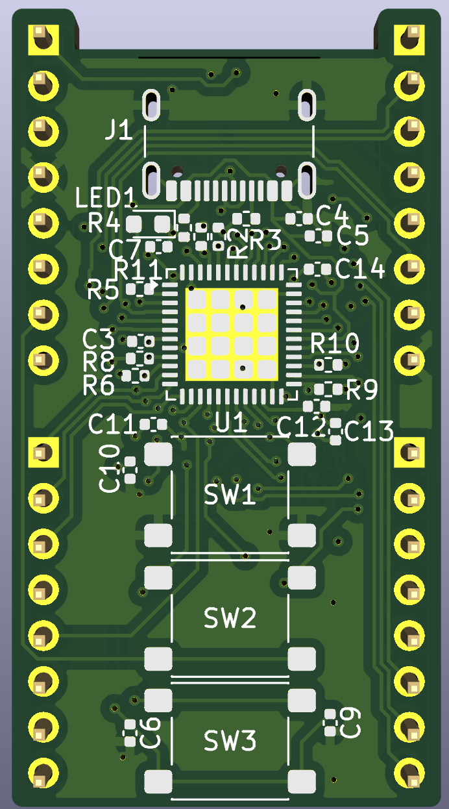

# Devboard

A small STM32 devboard for deving

## details
- Compatible with a breadboard
- USB-C programming port
- SD card holder
- 32 header pins total: 22 GPIO, including 9 analog inputs, plus debug and power pins
- STM32 MCU
- 4 layer board
- 24x44mm board size
- 2 side component assembly

## images
The board in PCB editor: 
The board in 3d viewer: 

## goal
- Purpose: a functional and useful devboard
- MCU: STM32 (MCU_ST_STM32F4:STM32F411CEUx)
- Features: USB-C + UART, SD card, expanded GPIO
- Size: as small as possible

## status

project finished!!
Once I get funding, I will order 10 assembled PCBs from PCBway.

## bom

Parts from the [PCBWay BOM](production/pcbway_bom.xlsx), with quantities for one board. The [KiCad CSV export](production/bom.csv) is also available.

| Reference | Qty | Manufacturer | Part number | Package |
| --- | ---: | --- | --- | --- |
| C1, C2 | 2 | Murata | GRM1555C1H180JA01D | 0402 |
| C3, C6, C7, C8, C9, C11, C15 | 7 | Samsung | CL05B104KB5NNNC | 0402 |
| C5, C13 | 2 | Samsung | CL05A105KO5NNNC | 0402 |
| C4, C14 | 2 | Samsung | CL05A106KP5NNNC | 0402 |
| C10 | 1 | Murata | GRM155R61A475MEAA | 0402 |
| C12 | 1 | Murata | GRM155R61A225KE95D | 0402 |
| R3, R4 | 2 | Yageo | RC0402FR-075K1L | 0402 |
| R9, R10, R11, R12, R13 | 5 | Yageo | RC0402FR-0747KL | 0402 |
| R8 | 1 | Yageo | RC0402FR-0710RL | 0402 |
| R1, R2, R6 | 3 | Yageo | RC0402FR-0710KL | 0402 |
| R5 | 1 | Yageo | RC0402FR-071KL | 0402 |
| U1 | 1 | STMicroelectronics | STM32F411CEU6 | QFN-48 7x7 |
| U2 | 1 | Diodes Incorporated | AP2112K-3.3TRG1 | SOT-23-5 |
| D1 | 1 | STMicroelectronics | USBLC6-2SC6 | SOT-23-6 |
| LED1 | 1 | Lite-On | LTST-C190GKT | 0603 |
| Y1 | 1 | Abracon | ABM3-25.000MHZ-D2Y-T | 5.0x3.2mm |
| J1 | 1 | GCT | USB4105-GF-A | USB-C 16P |
| J2 | 1 | Hirose | DM3AT-SF-PEJM5 | microSD |
| SW1, SW2, SW3 | 3 | C&K | PTS645SM43SMTR92 LFS | 6x6mm SMD |

The four through-hole headers are soldered separately and are not included in this BOM. For J1, check the USB4105 pin-length variant against the footprint, as noted in the PCBWay BOM.

## repo structure
- `devboard.kicad_pro` / `.kicad_sch` / `.kicad_pcb`: KiCad project (root)
- `journal.md`: devlog journals
- `README.md`: this file
- `production`: production files, like gerbers, bom, cpl
- `docs/pinout.md`: header pinout and on-board connections
- `firmware`: starter LED, button, and USB serial firmware

## getting started

[Pinout and connections](docs/pinout.md)

[Building and flashing the starter firmware](firmware/README.md)

Designed by EVV
Made for Hack Club Half Life
9/16/26
