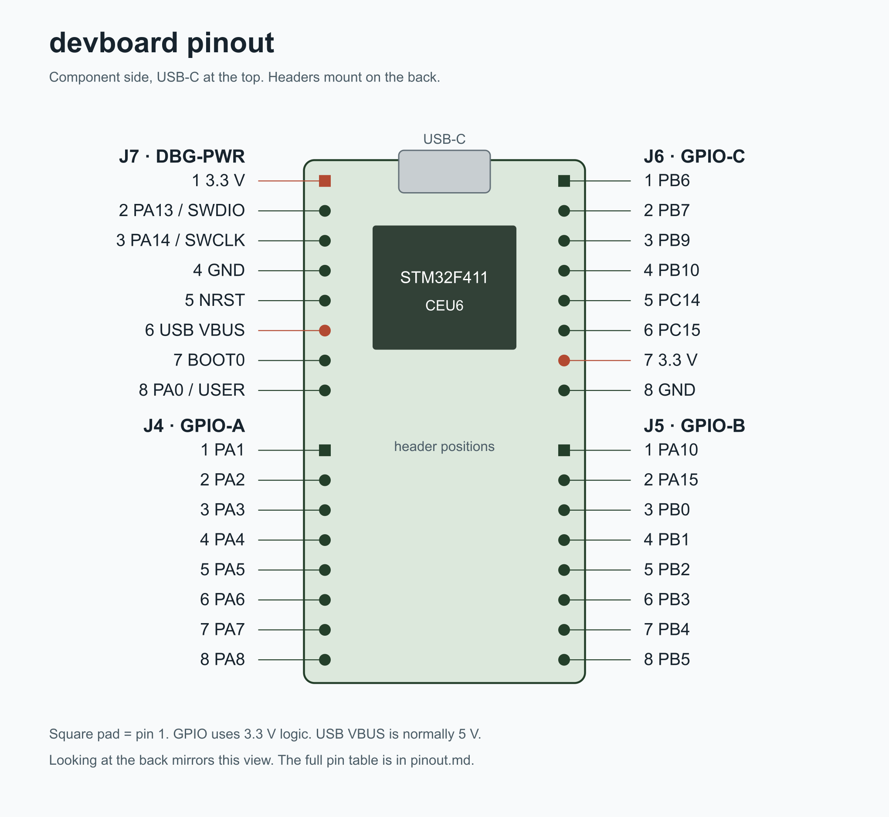

# Devboard pinout

View from the component side, with USB-C at the top. The headers are mounted on the back. Pin 1 is the square pad. Looking at the back mirrors the positions in this diagram.

The four headers have 32 pins total. J4, J5, and J6 expose 22 GPIO pins, including nine ADC inputs. J7 carries power, programming, reset, boot, and the user button.

| Pin | J7: upper left | J6: upper right | J4: lower left | J5: lower right |
| --- | --- | --- | --- | --- |
| 1 | 3.3 V | PB6 | PA1 / ADC1_IN1 | PA10 |
| 2 | PA13 / SWDIO | PB7 | PA2 / ADC1_IN2 | PA15 |
| 3 | PA14 / SWCLK | PB9 | PA3 / ADC1_IN3 | PB0 / ADC1_IN8 |
| 4 | GND | PB10 | PA4 / ADC1_IN4 | PB1 / ADC1_IN9 |
| 5 | NRST | PC14 | PA5 / ADC1_IN5 | PB2 |
| 6 | USB VBUS | PC15 | PA6 / ADC1_IN6 | PB3 |
| 7 | BOOT0 | 3.3 V | PA7 / ADC1_IN7 | PB4 |
| 8 | PA0 / USER | GND | PA8 | PB5 |

GPIO and ADC signals use 3.3 V logic. Keep analog inputs between GND and 3.3 V. USB VBUS is the USB supply, normally 5 V; it is not a GPIO pin. Power the first board from USB-C rather than driving the 3.3 V rail from another supply.

## On-board connections

| Function | MCU pin | Notes |
| --- | --- | --- |
| Green LED | PC13 | Active high, through R5 (1 kΩ) to the LED; LED cathode goes to GND |
| USER button | PA0 | Active high, external 10 kΩ pulldown; also on J7.8 |
| RESET button | NRST | Pulls reset low; also on J7.5 |
| BOOT0 button | BOOT0 | Pulls BOOT0 high; also on J7.7 |
| USB D− | PA11 | USB OTG FS, AF10 |
| USB D+ | PA12 | USB OTG FS, AF10 |
| USB VBUS sense | PA9 | Connected to USB VBUS |
| SWD data | PA13 | J7.2 |
| SWD clock | PA14 | J7.3 |
| Main crystal | PH0 / PH1 | 25 MHz |
| SD chip select | PB12 | Active low |
| SD clock | PB13 | SPI2, AF5 |
| SD MISO | PB14 | SPI2, AF5 |
| SD MOSI | PB15 | SPI2, AF5 |
| SD card detect | PB8 | Pulled up; check the socket switch behavior on the first board |

The SD slot is wired for SPI, not four-bit SDIO. Its DAT1 and DAT2 pins have pullups but are not connected to MCU data pins. PA0 and PC13 are occupied by the button and LED. PA9, PA11, and PA12 are occupied by USB. Keep PA13 and PA14 for SWD while debugging.

PA15, PB3, and PB4 have debug alternate functions after reset. If you use them as GPIO, configure them explicitly and keep SWD on PA13/PA14. PC14 and PC15 are low-speed oscillator pins that can be GPIO while the LSE oscillator is disabled.

Pin assignments were checked against both the schematic netlist and PCB pads. MCU alternate functions and ADC channels are listed in the [STM32F411 datasheet](https://www.st.com/resource/en/datasheet/stm32f411cc.pdf).
