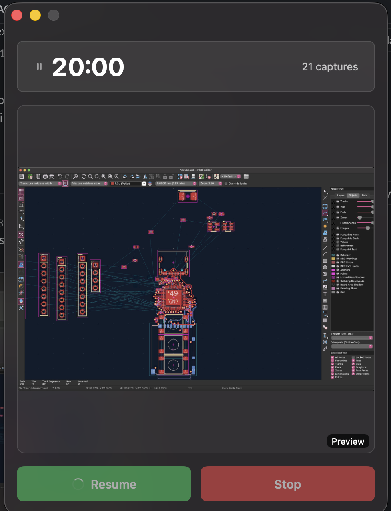
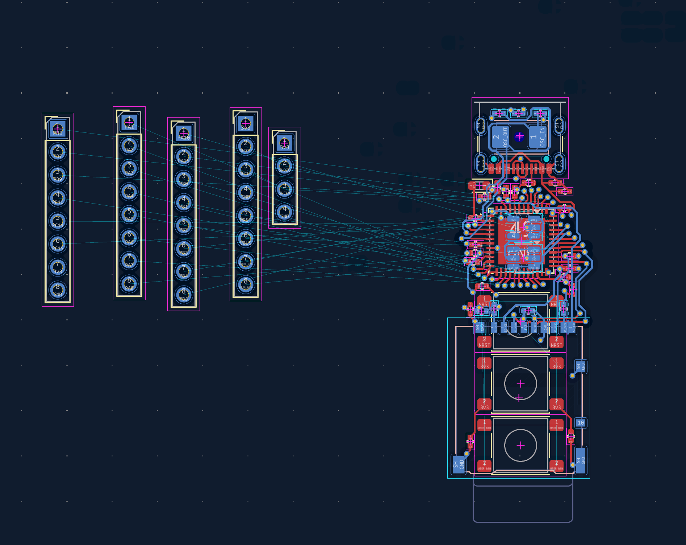
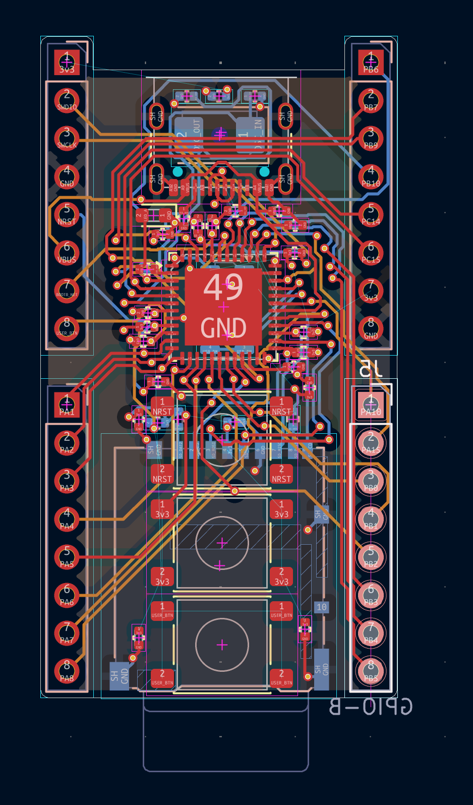
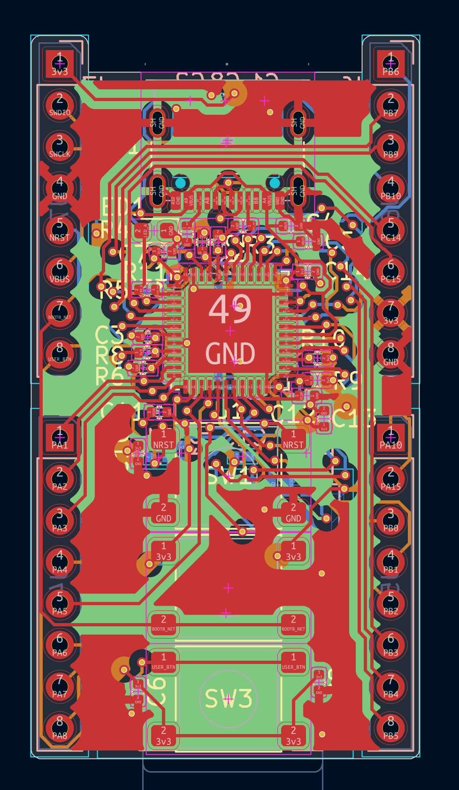
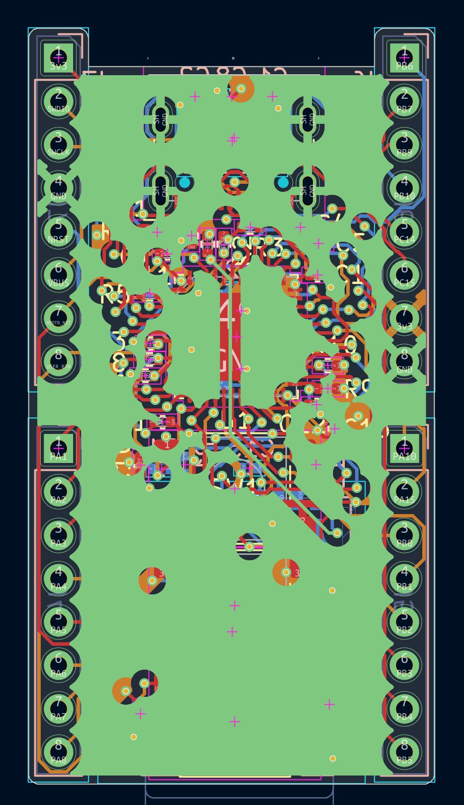
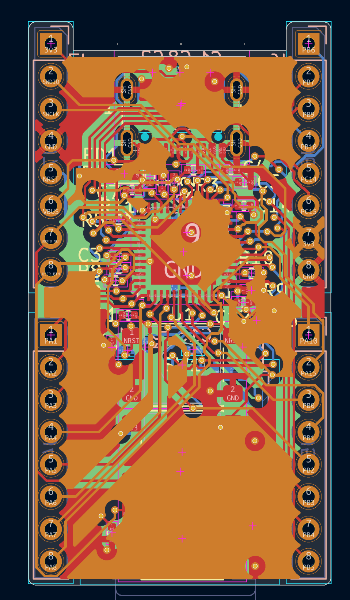
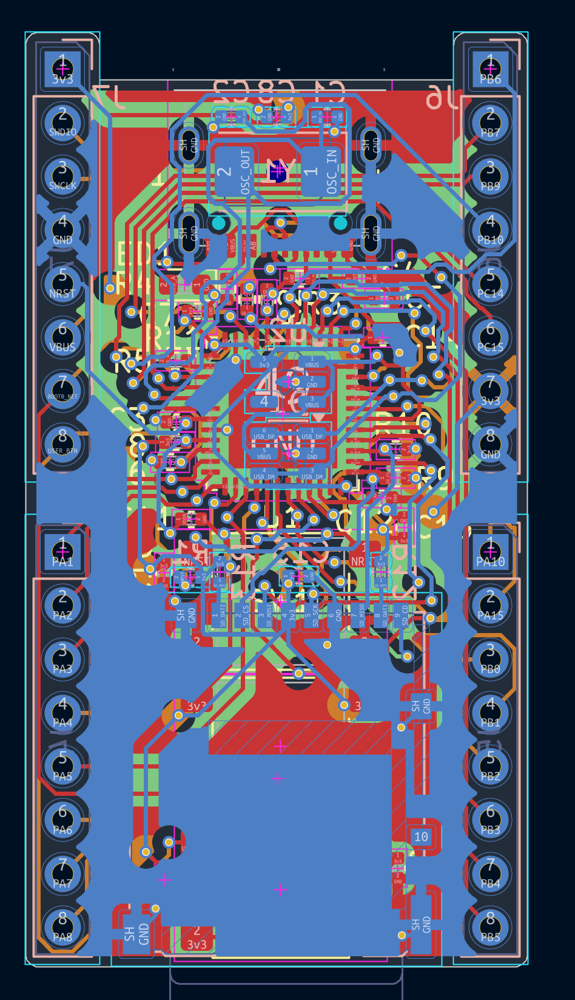
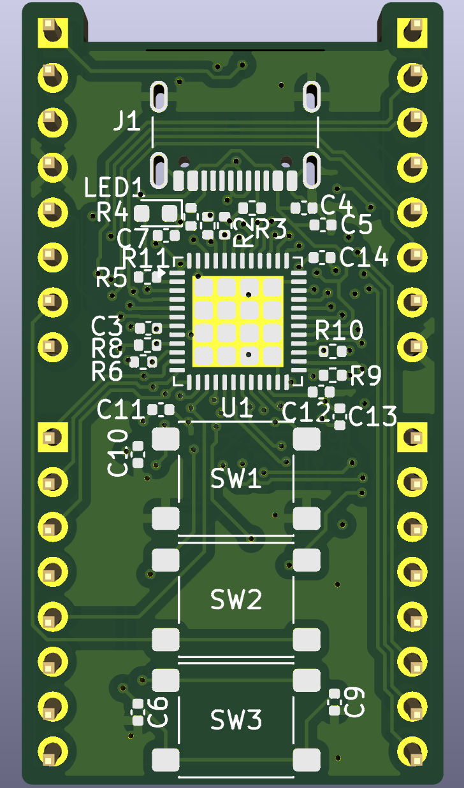
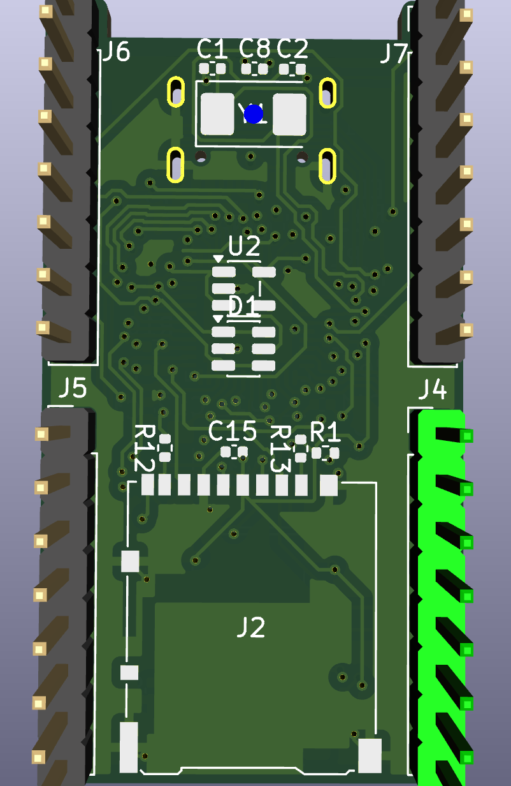

# Journal for my devboard

## Devlog 01: init and organizing repo and structure and KiCad project

Date: Sep 14
Time: 30 minutes

### what was done
- Created repo at `Documents/kicad/devboard` with `git init`
- Added `.gitignore` for KiCad + macOS
- Created structure: root KiCad project + `docs/devlog/`
- Created empty KiCad project `devboard` (`devboard.kicad_pro`, `devboard.kicad_sch`, `devboard.kicad_pcb`)
- Added and wrote `README.md`

### whats next
- decide MCU part + features + size target + layer stack

## Devlog 02:  decided the MCU and board spec.

Date: Sep 14
Time: 20 minutes

- MCU STM32F411CEU6 (UFQFPN48, 100MHz, USB FS, SDIO).
- USB-C native, no UART bridge, SWD for debug.
- microSD on SDMMC 4-bit.
- 4-layer, headers, smallest practical with clean USB.
- Next: schematic blocks (power, USB, clock, SWD, SD, GPIO).

## Devlog 03: completed the schematic!

Date: Sep 14
Time: 1 hour 30 minutes

Lapse link: [lapse](https://lapse.hackclub.com/timelapse/VmLhmJkZRPre)

I made a connection list so I have something to refer to while i made the schematic (that's why the lapse showed i kept alt tabbing), made the schematic, and after that i had to fix some things like missing capacitor gnds, stray gnd near header, and power flags.

Built: STM32F411CEU6 core with decoupling, AP2112K-3.3 power from USB-C,
USB-C with CC resistors and ESD, 25MHz crystal, NRST/BOOT0/USER buttons,
green LED, SWD plus debug header, microSD, GPIO broken out to headers.

Decisions: AP2112K over smaller LDOs for SD current peaks. SD runs in SPI mode
because SDIO_CMD needs PD2, which this package does not have.

Check: ERC 0 errors, netlist verified pin by pin, 45 parts, 50 nets.

Open for layout: microSD socket part number, header pitch, button and
crystal packages, then footprints and placement.

## Devlog 04: PCB work

Date: Sep 14-15
Time: 5 hours

I spent half an hour assigning footprints to all the symbols in the schematic, and then put them on the PCB.

(used lapse for this) I then placed all the parts in roughly the right positions, and then started routing:
[lapse pt1](https://lapse.hackclub.com/timelapse/6VpJYj4qbbbp)
my lapse got stuck when i clicked the resume button so no link :( but i had 20 minutes here 
Now ive finished the main routing, and all thats left to do is wire up the header pins. This is a 4 layer pcb, so the top and bottom layers are misc signals, the second layer is a ground plane, and I reserved the third layer for routing the header pins. I already have a fanout of vias at the mcu so it should be easy. I dont have a lapse link for this because i did this offline. 
Finished the main routing: . Again, no lapse with this one, because i did this offline. Most stuff is routed, but the header pins were quite hard because there were many vias in the way. I also noticed something weird with the buttons: all pads of each button are the same net, so I will fix that. Also, during routing, I put a 3v3 plane AND ground plane on the same layer, so I will have to redo the 3v3 stuff. I also placed the pins in a place so that it's compatible with a breadboard!
finished ALL routing! there were 23 more nets to route, did all of them. some pictures:      
during this time, i also cleared up some drc errors, mostly clearance violation stuff. theres still 8 things: 4hole clearance violations, which is out of my control because thats between one of the usb-c pads and the mounting hole for it, and also 4 of this thermal relief connection zone errors which i have no idea what they are, and will see what it is and fix now.
ok they ended up being fine to ignore

## Devlog 05: Fab outputs

Date: Sep 15
Time: 30 min

I made a production folder with the gerbers, bom, and cpl files. The bom took me a while to put together, i had to source all the right components.
I also found that C2 reads GND for some reason, so i fixed that.